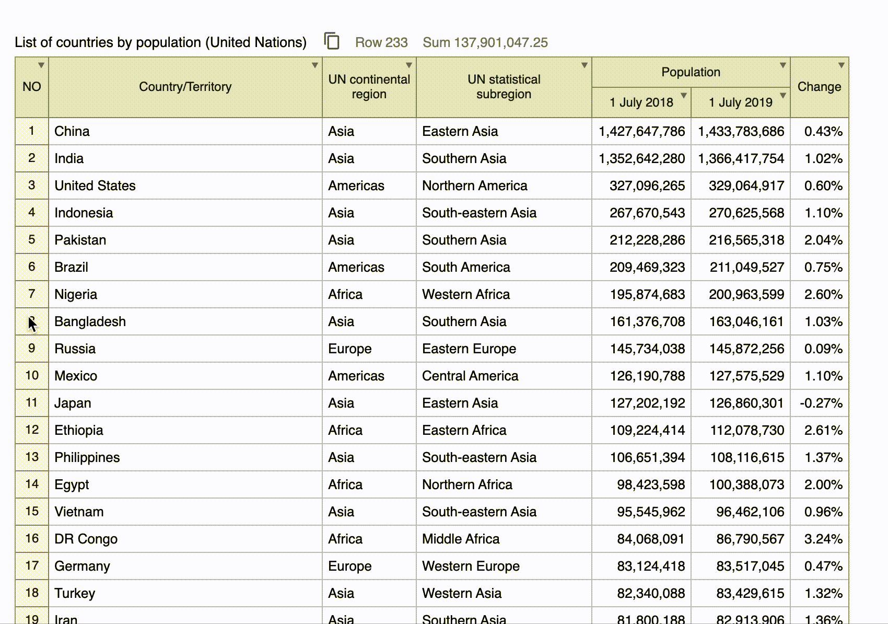

# sheetjs


Simple Spreadsheet UI by jQuery-plugin.

Just write **'sheetjs'** class into your **'table'** tag!



## Usage
1. Import jQuery 1.x, 2.x or 3.x from CDN
```html
<script src="https://ajax.googleapis.com/ajax/libs/jquery/1.12.4/jquery.min.js"></script>
```
2. Import Material Icons from CDN
```html
<link rel="stylesheet" href="https://fonts.googleapis.com/icon?family=Material+Icons">
```
3. Import sheetjs.css and sheetjs.js
```html
<link rel="stylesheet" href="sheetjs.css" />
<script src="sheetjs.js"></script>
```
4. Set "sheetjs" class to your table tag
```html
<table class="sheetjs">
  <caption>Table name(optional)</caption>
  <thead>
    <tr>
      <th>A</th>
      <th>B</th>
      <th>..</th>
    </tr>
  </thead>
  <tbody>
    <tr>
      <td>a</td>
      <td>b</td>
      <td>..</td>
    </tr>
    ..
  </tbody>
  <tfoot>
    (optional)
  </tfoot>
</table>
```

That's it!

## Specifications

- Prerequisites
  - Table tag is complete. Use thead, tbody, tfoot and caption properly.
  - Works on both IE7 and Chrome.
  
- Functions
  - Cell selection
    - Click the cell to select it.
    - Click with Shift-key, the rectangle will be sekected.
    - If another area is selected, the selection will be removed.
  - Line selection
    - Click 'th' at the beginning of a line in tbody, you can also select a ractangle by selectiong the line
    - Clicking on other element on th is not work
  - Column selection
    - Click on a colum 'thead th' to select all the columns with thead, tbody and tfoot.
    - 'th' only. 'td' does not react.
  - Value copy
    - Selecting cell text can be copy into your clipboard with Copy command, 'Ctrl + c' or right-click.
    - The copied value is in TSV (tab separated) text format and can be pasted into Excel as it is.
    - The text does not include INPUT or A tag link information. Extract only pure text
  - Filter
    - Select a cell and right-click to Filter to filter the entire table with the selected value
  - Line count display
    - The number of displayed tbody columns is automatically counted and displayed on the screen. If you have declared a caption tag.
  - Total value display
    - Sum the value of the selected cell and display it. If you have declared a caption tag.
    - Take out what looks like a number and add it up. For example, if you select 1,000 yen and A-100, 1000+ (-100) will be 900.
  - Header fixed
    - Follow only the header title as the window scrolls
  
- Functional restrictions in IE
  - Header fixed
  - Display button in the header filter (does not appear because the grit line is broken)
  − IE7 cannot use Fontawsome, so add text

